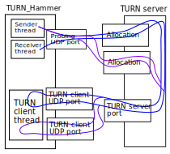

# TURN_Hammer

There are pre-built versions on Github Releases

## Note

Currently it is based on old Tokio 0.1 and fails to build with modern rustc.
Should work with rustc 1.34.2, but is expected to fail with 1.53.0.

## Usage

```
turnhammer 0.1.0
Vitaly _Vi Shukela <vi0oss@gmail.com>
A tool to stress-test TURN (RFC 5766) servers

USAGE:
    turnhammer [FLAGS] [OPTIONS] <server> <username> <password>

FLAGS:
        --audio      Set pps to 16 and pktsize to 192
    -f, --force      Override bandwidth or traffic limitation
    -h, --help       Prints help information
        --calc       Don't actually run, only calculate bandwidth and traffic
    -V, --version    Prints version information
        --video      Set pps to 90 and pktsize to 960

OPTIONS:
        --delay-after-stopping-sender <delay_after_stopping_sender>
            Seconds to wait and receive after stopping sender [default: 3]

        --delay-between-allocations <delay_between_allocations>
            Microseconds to wait between TURN allocations [default: 2000]

    -d, --duration <duration>                                          Experiment duration, seconds [default: 5]
    -j, --parallel-connections <num_connections>                       Number of simultaneous connections [default: 1]
    -s, --pkt-size <packet_size>                                       Packet size [default: 100]
        --pps <packets_per_second>                                     Packets per second [default: 5]

ARGS:
    <server>      TURN server address (hostname is not resolved)
    <username>    Username for TURN authorization
    <password>    Credential for TURN authorizaion
```

Output sample:

```
The test would do approx 11.878 Mbit/s and consume 158.379 megabytes of traffic
My external address: 178.122.56.8:40475
Allocated 200 TURN clients
Received the first datagram
Received 365652 packets from 384000 window of total 384000 || Loss: 04.7781%   bad loss: 00.0000%
RTT4 brackets: 0-49ms: 00.0000%   180-399ms: 50.7474%  1000-1999ms: 00.0000%
             50-179ms: 44.4745%   500-999ms: 00.0000%      2000+ms: 00.0000%
 <<<  Overall score:  8.2 / 10.0  >>>
Stopping TURN clients
```

## Algorithm

1. Create a UDP socket bound to `0.0.0.0:0`.
2. Get external address the socket
3. Create K other UDP sockets bound to `0.0.0.0:0` and obtain K allocations from specified TURN server
4. Add permission to address from "2." to each of that TURN allocations
5. In each of TURN client instance, send back each data message back to sender. This effectively makes K instances of UDP echo server at TURN side.
6. From the first UDP socket, send specified number of packets at specified rate to all those "echo servers".
7. Analyse replies from those "echo servers" and measure packet loss and round-trip times.


